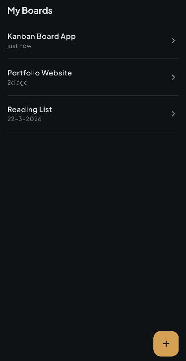
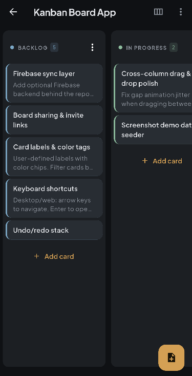
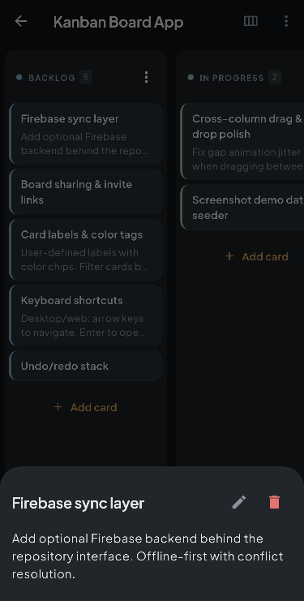
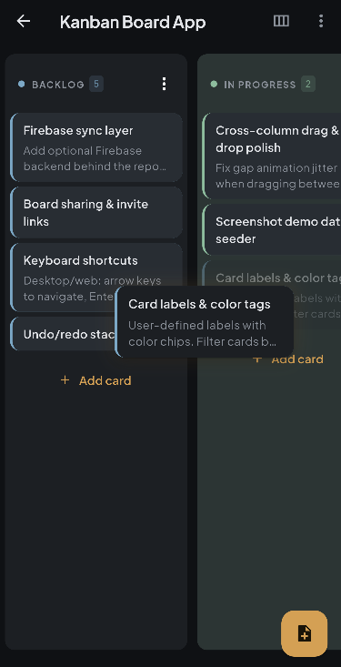
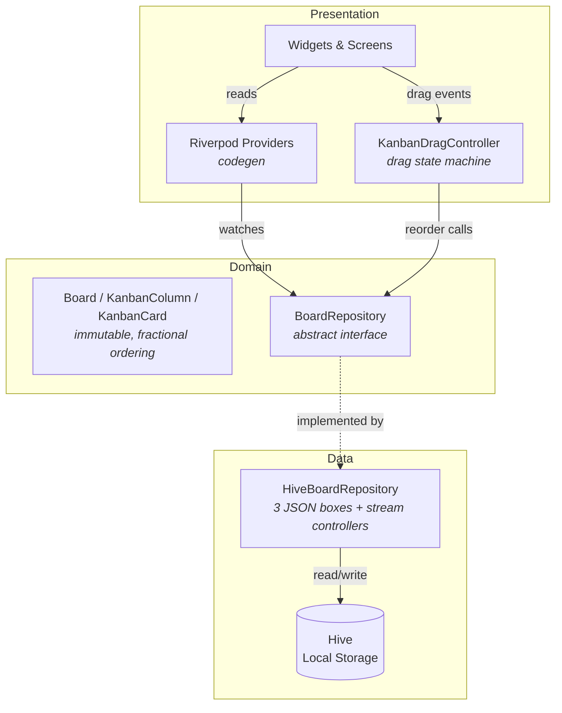

# Docket

A minimal, dark-mode-first kanban board built with Flutter. Local-first persistence via Hive, with a clean repository abstraction designed for a future Firebase swap. Custom drag-and-drop system with animated ghost cards, fractional indexing for O(1) reorder, and a zen aesthetic inspired by Linear and Vercel.


## Screenshots

<p>
  
  
  
  
</p>


## Getting Started

### Prerequisites

- **Flutter SDK** >= 3.x (with Dart SDK >= 3.11.1)
- A browser (for web) or connected Android device/emulator

### Setup

```bash
# Clone and install dependencies
git clone https://github.com/NYJvanMuijlwijk/docket-kanban
cd docket-kanban
flutter pub get

# Run Riverpod code generation (required before first build)
dart run build_runner build --delete-conflicting-outputs
```

### Run

```bash
flutter run -d chrome          # Web (development)
flutter run                    # Connected device (Android)
```

### Build for production

```bash
flutter build web              # Outputs to build/web/
```

### Verify the build

Run these in order — all three must pass:

```bash
flutter analyze                # Strict lint check (zero warnings/infos)
flutter test                   # Full test suite
flutter build web              # Production build
```

## Architecture

Docket follows a **feature-based architecture** where each feature owns its data, domain, and presentation layers. State flows unidirectionally: UI reads from Riverpod providers, which delegate to a repository interface backed by Hive.



### Walkthrough

Start here and follow the data flow:

1. **Entry point** — [`lib/main.dart`](lib/main.dart): Initializes Hive (three boxes: boards, columns, cards), wires `HiveBoardRepository` into Riverpod's `ProviderScope`, and launches `MaterialApp.router`.

2. **Router** — [`lib/router/app_router.dart`](lib/router/app_router.dart): Two routes via GoRouter. `createRouter()` is a factory (not a singleton) so tests don't leak state between runs.

3. **Domain models** — [`lib/features/board/domain/`](lib/features/board/domain/):
   - [`board.dart`](lib/features/board/domain/board.dart) — Board with name, timestamps, and column references
   - [`kanban_column.dart`](lib/features/board/domain/kanban_column.dart) — Column with a fractional `order` string
   - [`kanban_card.dart`](lib/features/board/domain/kanban_card.dart) — Card with title, description, and fractional `order`
   - [`board_repository.dart`](lib/features/board/domain/board_repository.dart) — Abstract interface: CRUD + `watch*` streams for reactivity

4. **Persistence** — [`lib/features/board/data/hive_board_repository.dart`](lib/features/board/data/hive_board_repository.dart): Implements the repository interface using three Hive boxes (`Box<Map<dynamic, dynamic>>`). Stores models as JSON maps with runtime casting on read. Cascade deletes (board -> columns -> cards) and `StreamController` broadcasting for reactive UI updates.

5. **State management** — [`lib/features/board/presentation/providers/`](lib/features/board/presentation/providers/): Riverpod 3.x codegen providers. Each provider watches the repository's streams and sorts by fractional order:
   - [`board_providers.dart`](lib/features/board/presentation/providers/board_providers.dart) — Board list (sorted by `lastUsedAt`) and single-board lookup
   - [`column_providers.dart`](lib/features/board/presentation/providers/column_providers.dart) — Columns for a board
   - [`card_providers.dart`](lib/features/board/presentation/providers/card_providers.dart) — Cards for a column
   - [`drag_providers.dart`](lib/features/board/presentation/providers/drag_providers.dart) — `KanbanDragController`: drag state machine with hover deduplication and adjacency suppression

6. **Board detail screen** — [`lib/features/board/presentation/board_detail_screen.dart`](lib/features/board/presentation/board_detail_screen.dart): The main board view, split into four `part` files for readability:
   - [`.card.dart`](lib/features/board/presentation/board_detail_screen.card.dart) — Per-column card list (`_CardListView`), card tiles
   - [`.column.dart`](lib/features/board/presentation/board_detail_screen.column.dart) — Column headers, popup menus, column-level drop targets
   - [`.drag.dart`](lib/features/board/presentation/board_detail_screen.drag.dart) — Ghost cards, insertion gaps, drag start/end handlers, cross-column move logic

7. **Core utilities** — [`lib/core/`](lib/core/):
   - [`theme.dart`](lib/core/theme.dart) — Material 3 dark/light themes (Plus Jakarta Sans, muted blueGrey seed)
   - [`reorder_helpers.dart`](lib/core/reorder_helpers.dart) — `computeOrderKeyBetween` (same-list) and `computeOrderKeyAtInsert` (cross-list) using fractional indexing
   - [`guard_mutation.dart`](lib/core/guard_mutation.dart) — Async mutation wrapper with error SnackBars
   - [`responsive.dart`](lib/core/responsive.dart) — Fluid column sizing, breakpoints, sheet/content max-widths
   - [`shimmer.dart`](lib/core/shimmer.dart) — Skeleton loading via shared `AnimationController`
   - [`animated_list_item.dart`](lib/core/animated_list_item.dart) — Staggered entrance animations (respects reduce-motion)
   - [`auto_scroll_handler.dart`](lib/features/board/presentation/auto_scroll_handler.dart) — Viewport-relative edge zones for drag-to-scroll

## Key Design Decisions

### Fractional indexing for O(1) reorder

Card and column ordering uses string keys from the [`fractional_indexing`](https://pub.dev/packages/fractional_indexing) package. Reordering generates a new key between two neighbors without touching any other row — O(1) instead of renumbering an entire list. Keys sort lexicographically, so the database query is a simple string sort.

### Repository pattern for future Firebase swap

[`BoardRepository`](lib/features/board/domain/board_repository.dart) is an abstract interface. The current [`HiveBoardRepository`](lib/features/board/data/hive_board_repository.dart) stores data locally. A future `FirebaseBoardRepository` can implement the same interface and be swapped in via a single Riverpod provider override — no UI changes needed.

### Custom drag-and-drop

The app originally used `drag_and_drop_lists` but outgrew it: the package didn't support animated ghost cards, viewport-relative auto-scroll, or the insertion gap UX we needed. The current system uses Flutter's built-in `Draggable`/`DragTarget` widgets coordinated by a Riverpod-managed [`KanbanDragController`](lib/features/board/presentation/providers/drag_providers.dart) state machine. This gives full control over hit-testing, ghost rendering, and animation timing.

### Naming: KanbanCard / KanbanColumn

Flutter's Material library exports `Card` and `Column` widgets. To avoid import conflicts and confusion in code review, domain models are prefixed with `Kanban` — `KanbanCard`, `KanbanColumn`.

### Dark-mode-first with opacity-based depth

The UI uses subtle alpha differences between surfaces to create depth, rather than drop shadows or heavy borders. The theme seed is a muted blueGrey. One accent color is used sparingly for interactive elements. See [`theme.dart`](lib/core/theme.dart).

## Code Quality

- **Linting:** [`very_good_analysis`](https://pub.dev/packages/very_good_analysis) with `strict-casts`, `strict-inference`, and `strict-raw-types` enabled. Zero tolerance — `flutter analyze` must exit clean (infos count as failures).
- **Member ordering:** Custom [`member_ordering_lints`](member_ordering_lints/) analyzer plugin (built on Dart's `analysis_server_plugin`). Enforces a consistent top-to-bottom order: constructors -> fields -> overrides -> public methods -> build -> private methods.
- **Tests:** Unit and widget tests in [`test/`](test/), using a [`FakeBoardRepository`](test/helpers/fake_board_repository.dart) for deterministic widget testing and real Hive + temp directories for integration tests.

## Project Structure

```
lib/
  main.dart                          # Entry point: Hive init, ProviderScope, MaterialApp.router
  core/                              # Shared utilities
    theme.dart                       #   Material 3 dark/light themes
    responsive.dart                  #   Breakpoints, fluid column sizing
    reorder_helpers.dart             #   Fractional index key computation
    guard_mutation.dart              #   Async error-handling wrapper
    shimmer.dart                     #   Skeleton loading animation
    animated_list_item.dart          #   Staggered entrance animation
    status_content.dart              #   Reusable empty/error state widget
    sheet_body.dart                  #   Bottom sheet layout helper
    confirm_dialog.dart              #   Confirmation dialog
    ...
  features/
    board/
      domain/                        # Models + repository interface
        board.dart                   #   Board model (immutable, JSON serializable)
        kanban_column.dart           #   Column model with fractional order
        kanban_card.dart             #   Card model with fractional order
        board_repository.dart        #   Abstract repository (CRUD + watch streams)
      data/                          # Repository implementations
        hive_board_repository.dart   #   Hive-backed persistence (3 JSON boxes)
      presentation/                  # UI layer
        board_list_screen.dart       #   Home: board list sorted by last-used
        board_detail_screen.dart     #   Board view (columns + cards + drag)
        board_detail_screen.card.dart    #   part: card list, card tiles
        board_detail_screen.column.dart  #   part: column headers, menus
        board_detail_screen.drag.dart    #   part: ghost cards, insertion gaps
        auto_scroll_handler.dart     #   Drag-to-scroll edge detection
        providers/                   #   Riverpod codegen providers
          board_providers.dart       #     Board list + single board
          column_providers.dart      #     Columns for a board
          card_providers.dart        #     Cards for a column
          drag_providers.dart        #     KanbanDragController state machine
        widgets/                     #   Reusable bottom sheets
          board_form_sheet.dart      #     Create/edit board
          card_form_sheet.dart       #     Create/edit card
          column_form_sheet.dart     #     Create/edit column
          column_management_sheet.dart   #   Column reorder/rename/delete
  router/
    app_router.dart                  # GoRouter config (factory, not singleton)
    error_screen.dart                # 404 / error fallback
test/
  helpers/
    fake_board_repository.dart       # Deterministic test repository
  features/                          # Mirrors lib/features/ structure
  core/                              # Core utility tests
member_ordering_lints/               # Custom analyzer plugin (local path dep)
```

## Roadmap

Docket is feature-complete as a local-first personal kanban board. The architecture is designed for a clean transition to cloud sync:

- **Slice 6: Firebase + Collaboration** — `FirebaseBoardRepository` implementing the existing `BoardRepository` interface, swapped via Riverpod provider override. Auth, Firestore security rules, real-time sync across devices. No UI changes required.
